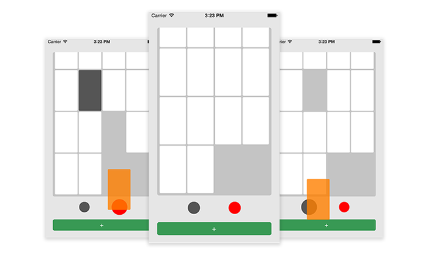

## DroppableView

A `DroppableView` represents a single draggable View. You may use it as a base class for any view, that you need to be draggable in your project. You can even use it to drag something out of a scrollview, as you can see in the example project.

### Usage

Initalize the DroppableView like in th following example:  

`- (instancetype)initWithDropTarget:(UIView*)target;`

- `target` is a view (outside of the scrollview), to where the element should be dragged.

If you use a DroppableView within a `UIScrollView`, you need to set `canCancelContentTouches = NO;` on the scrollView.

### Screenshots of the example app:

The white cards can be dragged out of the scrollView onto the gray & red circle. Try it!
  
